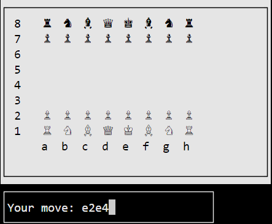
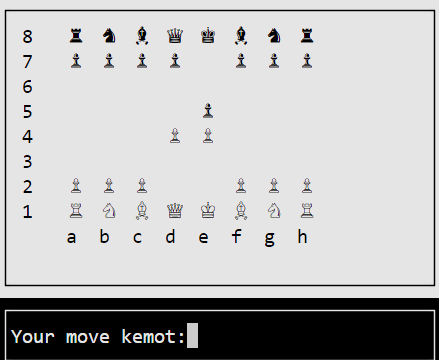
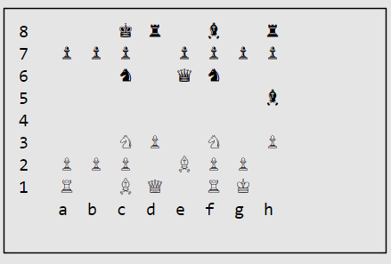

# Chess

#

#

#

# HOW TO USE

Simply use : g++ -o myChessGame main.cpp game.cpp chessAI.cpp gameHelper.cpp player.cpp ui.cpp -lncursesw

# ABOUT PROJECT

It's simple chess aplication which can be used to play player vs player or player vs ai.
AI is coded by me and you can choose difficulty level from 1 to 5 at the beginning of the game.
Also check the documentation in file 'dokumentacja'.
If you wanna check code go to projekt folder.
I use chess C++ library from this github : https://github.com/Disservin/chess-library
